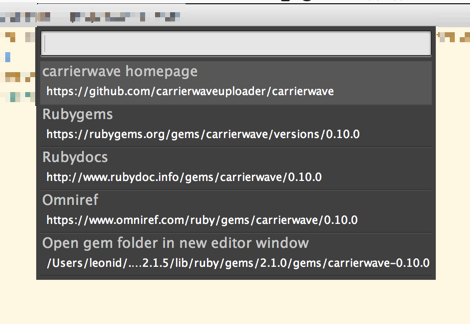

# Project is discontinued!

I'm not using Sublime Text anymore and have no interest in supporting this project. 

I added the MIT license to be explicit, so if you want to carry on, you have my full permission - and gratitude!

# Gem Links for Sublime Text

Easily navigate Rubygems used by your project.

## Usecase

If you often google for gems that you use, this is the plugin to break you out of this tedious routine.

## Instructions

1.  In a Sublime Text window with a Bundler-enabled Ruby project or script:

2.  Open the command palette (Cmd/Ctrl + Shift + P) and activate "Gem Links: List All Rubygems".

3.  You will see a list of all gems loaded by the project's Gemfile.lock.

4.  After choosing a gem you will see a menu of links:

    * to the gem's homepage;
    * to Rubygems, Rubydocs, and Omniref pages for that gem;
    * to the gem's local folder (opens in a new Sublime Text window).

5.  Choose any of the links to open it.

Take note: Gem Links only works when the Gemfile is valid and the gems are installed. In other words, if the project runs, the plugin should also work.

## Installation

Install "Gem Links" from Sublime Text's [Package Control](https://sublime.wbond.net).

If you use OS X and [rbenv](https://github.com/sstephenson/rbenv) or [RVM](https://rvm.io), chances are Sublime Text can't find the correct Ruby version by itself. Then you should install the [Fix Mac Path](https://github.com/int3h/SublimeFixMacPath) plugin, which makes the $PATH from your shell available in Sublime Text. (This will also fix all kinds of build tools dependent on custom $PATH.
)

---

(c) 2014 [Leonid Shevtsov](http://leonid.shevtsov.me)
